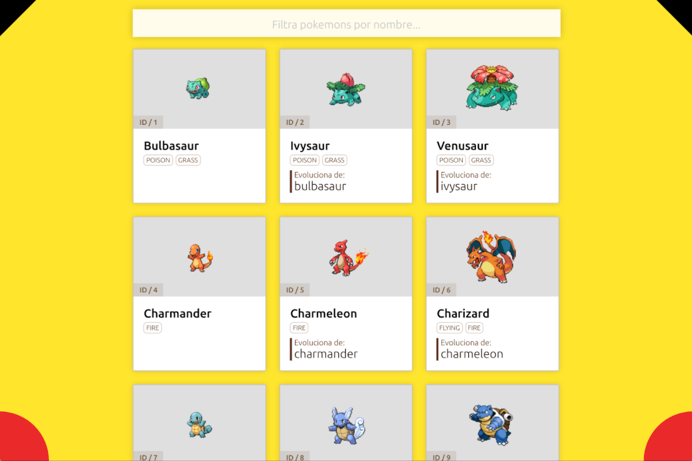

# Prueba técnica para Instructora/o de fullstack de Adalab

La prueba consiste en desarrollar una aplicación web (front y back) que sea un listado de Pokemons.

## Fase 1: front end

La solución entregada debe seguir la siguiente propuesta gráfica.

Para obtener la información de los Pokemon, hay que usar el API abierta https://pokeapi.co/.

### Listado

En la página principal debe aparecer un listado de Pokemons. De cada Pokemon mostraremos al menos esta información:

- Número
- Nombre
- Tipo (puede ser múltiple)
- Imagen
- Información de evolución: si es un Pokemon base o una evolución de otro.

### Filtrado

En la parte superior del listado aparece un campo de búsqueda para filtrar los Pokemon por nombre. Según se escribe en el campo se deben ir filtrando en local los Pokemons que aparecen en pantalla.

### Detalle de Pokemon

Al hacer click sobre un Pokemon, su tarjeta de información pasa a ocupar todo el espacio que ocupaba el listado. Además, cada Pokemon tiene una URL propia.

Al volver a hacer click en un botón de **Volver al listado**, vuelve a aparecer el listado.

## Fase 2: back end

Se propone crear un servidor API similar a https://pokeapi.co/ en Node JS, Express JS y una bases de datos de tu elección entre MySQL y MongoDB.

No hace falta desarrollar todos los endpoints disponibles en https://pokeapi.co/, sería suficiente con crear los endpoints que vayas a utilizar en esta aplicación.

## Entrega

Al ser dos proyectos se puede entregar en:

- Un solo proyecto que engloble los proyectos de front y de back, para lo cual el servidor debería tener un servidor de ficheros estáticos, o
- Dos proyectos independientes que se arranquen por separado.

En ambos casos te pedimos que todo el código esté en un solo repositorio con instrucciones sobre cómo arrancarlo.

El código desarrollado para solucionar la prueba debe subirse a un repositorio en GitHub o similar. La entrega consiste en enviar un enlace a este repositorio a yanelis@adalab.es. El plazo para realizarlo es de 7 días desde la recepción. Si no tienes disponibilidad suficiente avísanos, el objetivo no es programar con prisas. Una vez entregado, concertaremos una reunión para revisar el resultado de la prueba y entender cómo lo has planteado.

## Evaluación

Durante la revisión de la prueba valoraremos estos aspectos:

- Calidad de la maquetación y acercamiento a la línea gráfica propuesta.
- Estructura y calidad del código HTML / CSS / JavaScript / Node JS desarrollado.
- Uso adecuado de control de versiones.
- Didáctica a la hora de explicar la prueba.
- Se valorará muy positivamente el uso de tecnologías que enseñaremos en nuestro curso, como Sass, animaciones, React, React Router, Node JS, MySQL...

Si tienes cualquier duda o pregunta escríbeme a yanelisl@adalab.es y te la contestaré lo antes posible.

Muchas gracias por esforzarte en hacer esta prueba técnica.
